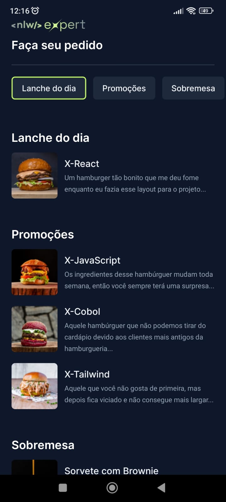

# Expert Foods

## Sobre
Aplicação mobile em React Native de uma hamburgueria, com cardápio, promoções e envio dos pedidos via whatsapp para o número da loja.

## Imagens
- Foods:
  

- Carrinho:

## Agradecimentos   
Desenvolvido durante o evento NLW Expert promovido pela [Rocktseat](https://www.rocketseat.com.br/), na trilha React Native.  

**Conteúdos:** Desenvolvimento de uma aplicação mobile em React Native, aplicação dos conceitos de Propriedades,
Estados e Componentes, tipagem com Typescript, Expo Framework, interface com Native Wind, gerenciamento de
estado global com Zustand, roteamento por arquivos com Expo Router.

___
**Contato:**  

